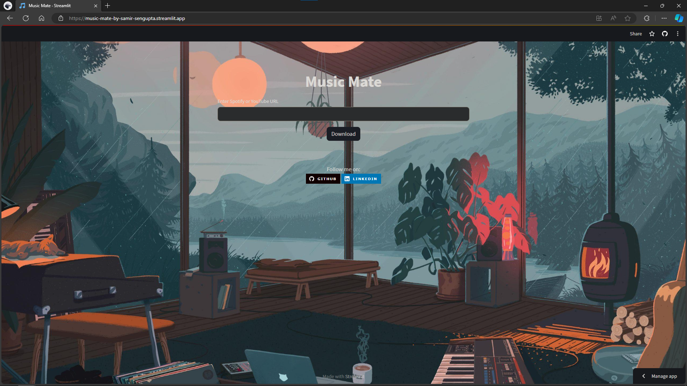

# Music Mate Lite

Music Mate Lite is a simple and user-friendly web application that allows users to download songs from YouTube or Spotify for free, without requiring any premium subscriptions. With Music Mate Lite, you can easily find and download your favorite songs to enjoy offline, anytime, anywhere.

## Features
- **Download Songs:** Search for your favorite songs and download them directly to your device.
- **YouTube and Spotify Support:** Access a vast library of songs from both YouTube and Spotify.
- **No Premium Required:** Enjoy downloading songs without the need for any premium subscriptions.
- **User-Friendly Interface:** The application is designed to be intuitive and easy to use for users of all levels.

## Usage
1. Visit the Music Mate Lite website [here](https://music-mate-by-samir-sengupta.streamlit.app/).
2. Enter the name of the song you want to download in the search bar.
3. Select the desired song from the search results.
4. Click on the download button to save the song to your device.

## Screenshots

*Caption for Screenshot 1*

<<<<<<< Updated upstream
=======

*Caption for Screenshot 2*

>>>>>>> Stashed changes
## Development
This application is built using Streamlit, a Python library for building web applications. You can find the source code for Music Mate Lite on GitHub [here](#).

To run the application locally, follow these steps:
1. Clone the repository.
2. Install the required dependencies using `pip install -r requirements.txt`.
3. Run the application using `streamlit run app.py`.

## Feedback
If you have any feedback or suggestions for improvement, feel free to contact us:
- LinkedIn: [Samir Sengupta](https://www.linkedin.com/in/samirsengupta/)
- GitHub: [SamirSengupta](https://github.com/SamirSengupta)

I would love to hear from you!

## Author
Music Mate Lite is created and maintained by [Samir Sengupta](https://neuralthread.cloud/samir).

## Disclaimer
Music Mate Lite is intended for personal use only. Please respect copyright laws and only download songs for which you have the necessary rights or permissions.

Enjoy downloading your favorite songs with Music Mate Lite! 🎵
